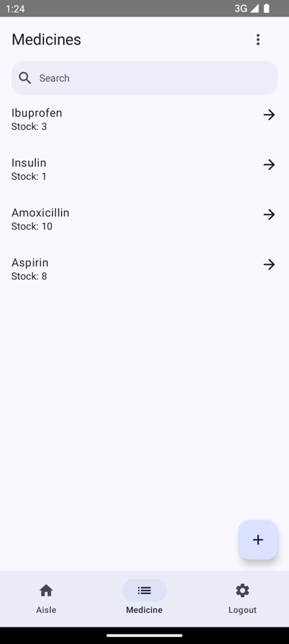
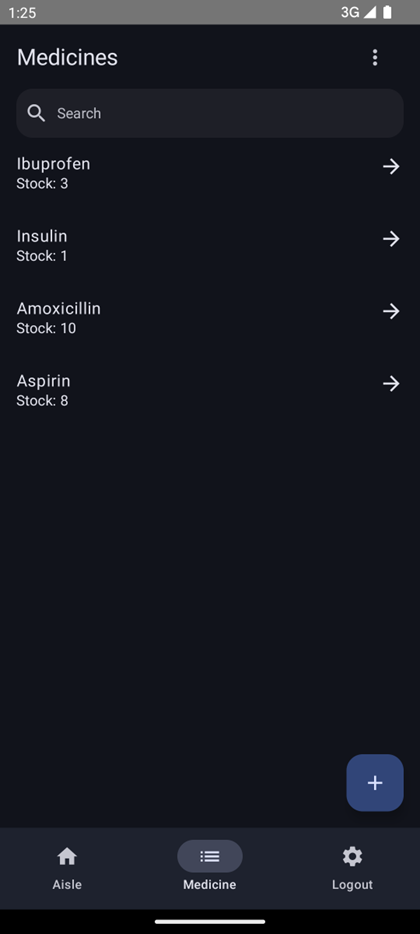
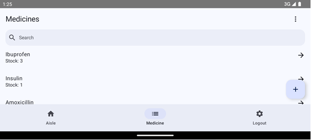

 

# P17 - Projet Rebonnte

- Application permettant de gérer un stock de mécicaments.
- Fonctionnalités : Liste, recherche, ajout, suppression, et mise à jour de stock des médicaments
- Compatibilité : Version minimale Android 7

## Technologies
- Jetpack Compose
- Kotlin 
- Backend Firebase :
	- Authentication
	- Firestore Database
	- App Distribution

## Concepts

- Pattern : MVVM
- Tests : Unitaires et instrumentés
- CI / CD : GitHub Actions pour déployer l'application à chaque tag.
- Accessibilité : Validation d'Accessibility Scanner + tests manuels avec TalkBack
- UI : portrait, paysage, téléphone et tablette, mode clair et sombre

## Impressions d'écran

	
	

	

	

	

	

